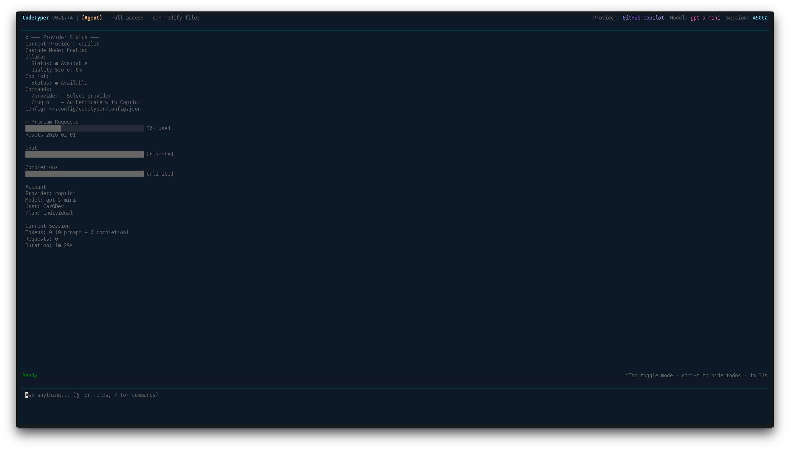
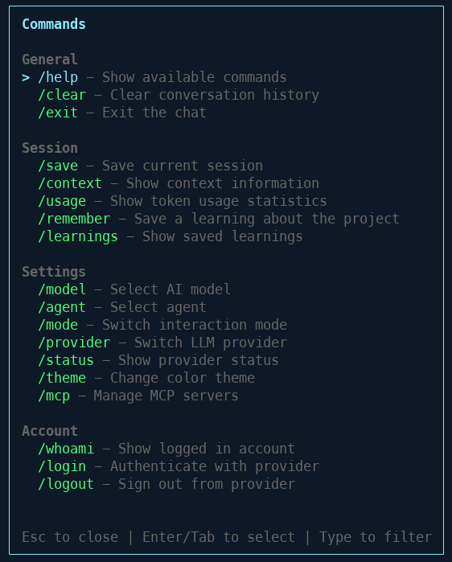
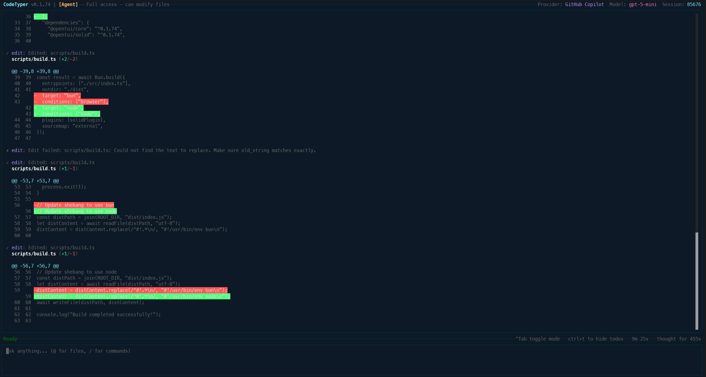
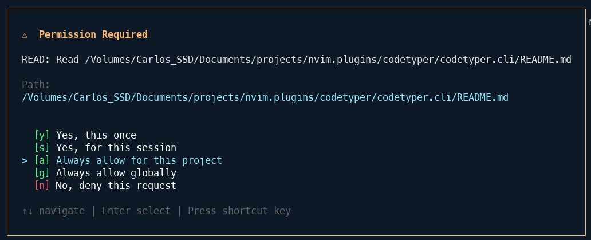
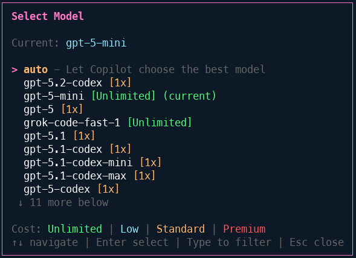
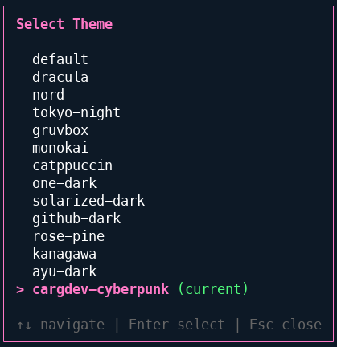

# CodeTyper CLI

<p align="center">
  
</p>

<p align="center">
  <a href="https://github.com/CarGDev/codetyper.cli/releases"></a>
  <a href="https://github.com/CarGDev/codetyper.cli/blob/master/LICENSE"></a>
  <a href="https://bun.sh"></a>
</p>

An AI-powered terminal coding agent with an interactive TUI. CodeTyper autonomously executes coding tasks using tool calls with granular permission controls and intelligent provider routing.

## How It Works

CodeTyper is an autonomous coding agent that runs in your terminal. You describe what you want to build or fix, and CodeTyper:

1. **Analyzes** your request and breaks it into steps
2. **Executes** tools (bash, read, write, edit) to accomplish the task
3. **Asks permission** before modifying files or running commands
4. **Learns** from your project to provide context-aware assistance

### Cascading Provider System

CodeTyper uses an intelligent provider routing system:

```
User Request
     |
     v
[Detect Task Type] --> code_generation, bug_fix, refactoring, etc.
     |
     v
[Check Ollama Score] --> Quality score from past interactions
     |
     v
[Route Decision]
     |
     +-- High Score (85%+) --> Ollama Only (trusted)
     |
     +-- Low Score (40%-) --> Copilot Only (needs improvement)
     |
     +-- Medium Score --> Cascade Mode
                              |
                              v
                         [1. Ollama generates response]
                              |
                              v
                         [2. Copilot audits for issues]
                              |
                              v
                         [3. Update quality scores]
                              |
                              v
                         [Return best response]
```

Over time, CodeTyper learns which provider performs best for different task types.

## Installation

**Requires [Bun](https://bun.sh) runtime** (v1.0.0+)

```bash
# Install Bun if you don't have it
curl -fsSL https://bun.sh/install | bash

# Install globally via npm
npm install -g codetyper-cli

# Or install from source
git clone https://github.com/CarGDev/codetyper.cli.git
cd codetyper.cli
bun install && bun run build && bun link

# Login to a provider
codetyper login copilot

# Start interactive chat
codetyper
```

## Features

### Interactive TUI

Full-screen terminal interface with real-time streaming responses.



**Key bindings:**

- `Enter` - Send message
- `Shift+Enter` - New line
- `@` - Open file picker (works anywhere in input)
- `/` - Open command menu (works anywhere in input)
- `Ctrl+M` - Toggle interaction mode
- `Ctrl+T` - Toggle todo panel
- `Ctrl+O` - Toggle activity panel
- `Shift+Up/Down` - Scroll log panel
- `Ctrl+C` (twice) - Exit

### Vim Motions

Optional vim-style keyboard navigation for power users. Enable in settings.

**Normal Mode:**

- `j/k` - Scroll down/up
- `gg/G` - Jump to top/bottom
- `Ctrl+d/u` - Half page scroll
- `/` - Search, `n/N` - Next/prev match
- `i` - Enter insert mode
- `:` - Command mode (`:q` quit, `:w` save)

**Configuration:**

```json
{
  "vim": {
    "enabled": true,
    "startInNormalMode": true
  }
}
```

### Command Menu

Press `/` to access all commands organized by category.



**Available Commands:**

| Category | Command      | Description                       |
| -------- | ------------ | --------------------------------- |
| General  | `/help`      | Show available commands           |
| General  | `/clear`     | Clear conversation history        |
| General  | `/exit`      | Exit the chat                     |
| Session  | `/save`      | Save current session              |
| Session  | `/context`   | Show context information          |
| Session  | `/usage`     | Show token usage statistics       |
| Session  | `/remember`  | Save a learning about the project |
| Session  | `/learnings` | Show saved learnings              |
| Settings | `/model`     | Select AI model                   |
| Settings | `/agent`     | Select agent                      |
| Settings | `/mode`      | Switch interaction mode           |
| Settings | `/provider`  | Switch LLM provider               |
| Settings | `/status`    | Show provider status              |
| Settings | `/theme`     | Change color theme                |
| Settings | `/mcp`       | Manage MCP servers                |
| Account  | `/whoami`    | Show logged in account            |
| Account  | `/login`     | Authenticate with provider        |
| Account  | `/logout`    | Sign out from provider            |

### Agent Mode with Diff View

When CodeTyper modifies files, you see a clear diff view of changes.



**Interaction Modes:**

- **Agent** - Full access, can modify files
- **Ask** - Read-only, answers questions
- **Code Review** - Review PRs and diffs

### Permission System

Granular control over what CodeTyper can do. Every file operation requires approval.



**Permission Scopes:**

- `[y]` Yes, this once
- `[s]` Yes, for this session
- `[a]` Always allow for this project
- `[g]` Always allow globally
- `[n]` No, deny this request

### Model Selection

Access to multiple AI models through GitHub Copilot.



**Available Models:**

- GPT-5, GPT-5-mini (Unlimited)
- GPT-5.2-codex, GPT-5.1-codex
- Grok-code-fast-1
- And more...

### Theme System

15+ built-in themes to customize your experience.



**Available Themes:**
default, dracula, nord, tokyo-night, gruvbox, monokai, catppuccin, one-dark, solarized-dark, github-dark, rose-pine, kanagawa, ayu-dark, cargdev-cyberpunk, pink-purple

## Providers

| Provider           | Models                      | Auth Method         | Use Case                    |
| ------------------ | --------------------------- | ------------------- | --------------------------- |
| **GitHub Copilot** | GPT-5, Claude, Gemini       | OAuth (device flow) | Cloud-based, high quality   |
| **Ollama**         | Llama, DeepSeek, Qwen, etc. | Local server        | Private, offline, zero-cost |

### Cascade Mode

When both providers are available, CodeTyper can use them together:

1. **Ollama** processes the request first (fast, local)
2. **Copilot** audits the response for issues
3. Quality scores update based on audit results
4. Future requests route based on learned performance

Check provider status with `/status`:

```
═══ Provider Status ═══

Current Provider: copilot
Cascade Mode: Enabled

Ollama:
  Status: ● Available
  Quality Score: 72%

Copilot:
  Status: ● Available
```

## Configuration

Settings are stored in `~/.config/codetyper/config.json`:

```json
{
  "provider": "copilot",
  "model": "auto",
  "theme": "default",
  "cascadeEnabled": true,
  "maxIterations": 20,
  "timeout": 30000
}
```

### Project Context

CodeTyper reads project-specific context from:

- `.github/` - GitHub workflows and templates
- `.codetyper/` - Project-specific rules and learnings
- `rules.md` - Custom instructions for the AI

## CLI Usage

```bash
# Start interactive TUI
codetyper

# Start with a prompt
codetyper "Create a REST API with Express"

# Continue last session
codetyper --continue

# Resume specific session
codetyper --resume <session-id>

# Use specific provider
codetyper --provider ollama

# Print mode (non-interactive)
codetyper --print "Explain this codebase"
```

## Tools

CodeTyper has access to these built-in tools:

| Tool         | Description                         |
| ------------ | ----------------------------------- |
| `bash`       | Execute shell commands              |
| `read`       | Read file contents                  |
| `write`      | Create or overwrite files           |
| `edit`       | Find and replace in files           |
| `glob`       | Find files by pattern               |
| `grep`       | Search file contents                |
| `lsp`        | Language Server Protocol operations |
| `web_search` | Search the web                      |
| `todo-read`  | Read current todo list              |
| `todo-write` | Update todo list                    |

### MCP Integration

Connect external MCP (Model Context Protocol) servers for extended capabilities:

```bash
# Browse and search available servers
/mcp browse        # Interactive browser
/mcp search <query> # Search by keyword
/mcp popular       # Show popular servers
/mcp categories    # List all categories

# Install a server
/mcp install sqlite
/mcp install github

# Manage servers
/mcp status        # Show connected servers
/mcp connect       # Connect all servers
/mcp disconnect    # Disconnect all servers
/mcp tools         # List available tools
/mcp add           # Add custom server
```

**MCP Browser Features:**

- Search by name, description, or tags
- Filter by category (database, web, AI, etc.)
- View server details and required environment variables
- One-click installation and connection
- 15+ verified servers from Anthropic

## Extensibility

### Hooks System

Lifecycle hooks for intercepting tool execution and session events.

**Hook Events:**

- `PreToolUse` - Validate/modify before tool execution
- `PostToolUse` - Side effects after tool execution
- `SessionStart` - At session initialization
- `SessionEnd` - At session termination
- `UserPromptSubmit` - When user submits input
- `Stop` - When execution stops

**Configuration** (`.codetyper/hooks.json`):

```json
{
  "hooks": [
    {
      "event": "PreToolUse",
      "script": ".codetyper/hooks/validate.sh",
      "timeout": 5000
    },
    { "event": "PostToolUse", "script": ".codetyper/hooks/notify.sh" }
  ]
}
```

**Exit Codes:**

- `0` - Allow (optionally output `{"updatedInput": {...}}` to modify args)
- `1` - Warn but continue
- `2` - Block execution

### Plugin System

Extend CodeTyper with custom tools, commands, and hooks.

**Plugin Structure:**

```
.codetyper/plugins/{name}/
├── plugin.json          # Manifest
├── tools/
│   └── *.ts             # Custom tool definitions
├── commands/
│   └── *.md             # Slash commands
└── hooks/
    └── *.sh             # Plugin-specific hooks
```

**Manifest** (`plugin.json`):

```json
{
  "name": "my-plugin",
  "version": "1.0.0",
  "tools": [{ "name": "custom_tool", "file": "tool.ts" }],
  "commands": [{ "name": "mycommand", "file": "cmd.md" }]
}
```

**Custom Tool Definition:**

```typescript
import { z } from "zod";
export default {
  name: "custom_tool",
  description: "Does something",
  parameters: z.object({ input: z.string() }),
  execute: async (args, ctx) => ({
    success: true,
    title: "Done",
    output: "...",
  }),
};
```

### Session Forking

Branch and rewind session history for experimentation.

**Commands:**
| Command | Description |
|---------|-------------|
| `/snapshot [name]` | Create checkpoint |
| `/rewind [n\|name]` | Go back to snapshot |
| `/fork [name]` | Branch current session |
| `/forks` | List all forks |
| `/switch [name]` | Switch to fork |

Sessions are stored in `.codetyper/sessions/` with automatic commit message suggestions.

## Roadmap

### v0.4.0 - Agent Completion

The next major release focuses on production-ready autonomous agent execution:

| Feature                                 | Issue                                                       | Status  |
| --------------------------------------- | ----------------------------------------------------------- | ------- |
| Plan Approval Gate                      | [#111](https://github.com/CarGDev/codetyper.cli/issues/111) | Planned |
| Diff Preview Before Write               | [#112](https://github.com/CarGDev/codetyper.cli/issues/112) | Planned |
| Execution Control (Pause/Resume/Abort)  | [#113](https://github.com/CarGDev/codetyper.cli/issues/113) | Planned |
| Consistent Model Behavior               | [#114](https://github.com/CarGDev/codetyper.cli/issues/114) | Planned |
| Quality Gates (TypeScript, Lint, Tests) | [#115](https://github.com/CarGDev/codetyper.cli/issues/115) | Planned |

### Known Issues

- Agent mode executes without waiting for user plan approval
- Different LLM models may behave inconsistently during agent execution
- No diff preview before file modifications

See [CHANGELOG](docs/CHANGELOG.md) for full version history.

## Development

```bash
# Watch mode
bun run dev

# Type check
bun run typecheck

# Build
bun run build

# Run tests
bun test

# Lint
bun run lint
```

## Recent Changes (v0.4.2)

- **Session Stats on Exit**: Displays detailed session summary when quitting:
  - Total API time spent, session duration, code changes (+/-)
  - Per-model token usage breakdown with resume command
- **Pink Purple Theme**: New built-in color theme
- **Activity Panel Toggle**: `Ctrl+O` to show/hide the activity panel
- **Image Paste Fix**: Fixed race condition where pasted images were silently dropped
- **Terminal Exit Fix**: Fixed `997;1n` garbage text appearing on exit
- **@ and / Anywhere**: File picker and command menu now work at any cursor position
- **Plan Approval Gate**: User confirmation before agent executes plans
- **Execution Control**: Pause, resume, and abort agent execution
- **Text Clipboard Copy/Read**: Cross-platform clipboard operations with mouse selection

See [CHANGELOG](docs/CHANGELOG.md) for complete version history.

## Documentation

- [Changelog](docs/CHANGELOG.md) - Version history and changes
- [Contributing](docs/CONTRIBUTING.md) - How to contribute

## License

MIT - See [LICENSE](LICENSE) for details.
