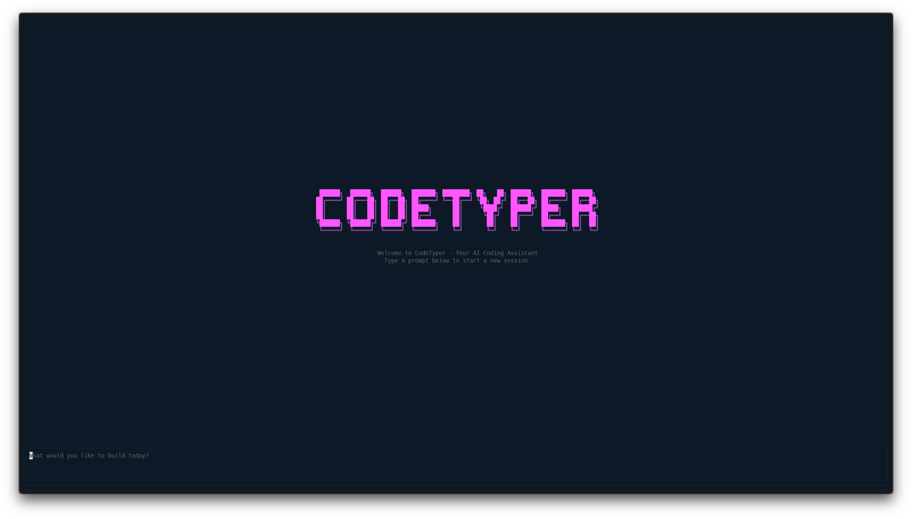

# CodeTyper CLI

An AI-powered terminal coding agent with an interactive TUI. CodeTyper autonomously executes coding tasks using tool calls with granular permission controls and intelligent provider routing.



## How It Works

CodeTyper is an autonomous coding agent that runs in your terminal. You describe what you want to build or fix, and CodeTyper:

1. **Analyzes** your request and breaks it into steps
2. **Executes** tools (bash, read, write, edit) to accomplish the task
3. **Asks permission** before modifying files or running commands
4. **Learns** from your project to provide context-aware assistance

### Cascading Provider System

CodeTyper uses an intelligent provider routing system:

```
User Request
     |
     v
[Detect Task Type] --> code_generation, bug_fix, refactoring, etc.
     |
     v
[Check Ollama Score] --> Quality score from past interactions
     |
     v
[Route Decision]
     |
     +-- High Score (85%+) --> Ollama Only (trusted)
     |
     +-- Low Score (40%-) --> Copilot Only (needs improvement)
     |
     +-- Medium Score --> Cascade Mode
                              |
                              v
                         [1. Ollama generates response]
                              |
                              v
                         [2. Copilot audits for issues]
                              |
                              v
                         [3. Update quality scores]
                              |
                              v
                         [Return best response]
```

Over time, CodeTyper learns which provider performs best for different task types.

## Installation

**Requires [Bun](https://bun.sh) runtime** (v1.0.0+)

```bash
# Install Bun if you don't have it
curl -fsSL https://bun.sh/install | bash

# Install globally via npm
npm install -g codetyper-cli

# Or install from source
git clone https://github.com/CarGDev/codetyper.cli.git
cd codetyper.cli
bun install && bun run build && bun link

# Login to a provider
codetyper login copilot

# Start interactive chat
codetyper
```

## Features

### Interactive TUI

Full-screen terminal interface with real-time streaming responses.


**Key bindings:**
- `Enter` - Send message
- `Shift+Enter` - New line
- `/` - Open command menu
- `Ctrl+Tab` - Toggle interaction mode
- `Ctrl+T` - Toggle todo panel
- `Shift+Up/Down` - Scroll log panel
- `Ctrl+C` (twice) - Exit

### Command Menu

Press `/` to access all commands organized by category.


**Available Commands:**

| Category | Command | Description |
|----------|---------|-------------|
| General | `/help` | Show available commands |
| General | `/clear` | Clear conversation history |
| General | `/exit` | Exit the chat |
| Session | `/save` | Save current session |
| Session | `/context` | Show context information |
| Session | `/usage` | Show token usage statistics |
| Session | `/remember` | Save a learning about the project |
| Session | `/learnings` | Show saved learnings |
| Settings | `/model` | Select AI model |
| Settings | `/agent` | Select agent |
| Settings | `/mode` | Switch interaction mode |
| Settings | `/provider` | Switch LLM provider |
| Settings | `/status` | Show provider status |
| Settings | `/theme` | Change color theme |
| Settings | `/mcp` | Manage MCP servers |
| Account | `/whoami` | Show logged in account |
| Account | `/login` | Authenticate with provider |
| Account | `/logout` | Sign out from provider |

### Agent Mode with Diff View

When CodeTyper modifies files, you see a clear diff view of changes.


**Interaction Modes:**
- **Agent** - Full access, can modify files
- **Ask** - Read-only, answers questions
- **Code Review** - Review PRs and diffs

### Permission System

Granular control over what CodeTyper can do. Every file operation requires approval.


**Permission Scopes:**
- `[y]` Yes, this once
- `[s]` Yes, for this session
- `[a]` Always allow for this project
- `[g]` Always allow globally
- `[n]` No, deny this request

### Model Selection

Access to multiple AI models through GitHub Copilot.


**Available Models:**
- GPT-5, GPT-5-mini (Unlimited)
- GPT-5.2-codex, GPT-5.1-codex
- Grok-code-fast-1
- And more...

### Theme System

14+ built-in themes to customize your experience.


**Available Themes:**
default, dracula, nord, tokyo-night, gruvbox, monokai, catppuccin, one-dark, solarized-dark, github-dark, rose-pine, kanagawa, ayu-dark, cargdev-cyberpunk

## Providers

| Provider | Models | Auth Method | Use Case |
|----------|--------|-------------|----------|
| **GitHub Copilot** | GPT-5, Claude, Gemini | OAuth (device flow) | Cloud-based, high quality |
| **Ollama** | Llama, DeepSeek, Qwen, etc. | Local server | Private, offline, zero-cost |

### Cascade Mode

When both providers are available, CodeTyper can use them together:

1. **Ollama** processes the request first (fast, local)
2. **Copilot** audits the response for issues
3. Quality scores update based on audit results
4. Future requests route based on learned performance

Check provider status with `/status`:

```
═══ Provider Status ═══

Current Provider: copilot
Cascade Mode: Enabled

Ollama:
  Status: ● Available
  Quality Score: 72%

Copilot:
  Status: ● Available
```

## Configuration

Settings are stored in `~/.config/codetyper/config.json`:

```json
{
  "provider": "copilot",
  "model": "auto",
  "theme": "default",
  "cascadeEnabled": true,
  "maxIterations": 20,
  "timeout": 30000
}
```

### Project Context

CodeTyper reads project-specific context from:
- `.github/` - GitHub workflows and templates
- `.codetyper/` - Project-specific rules and learnings
- `rules.md` - Custom instructions for the AI

## CLI Usage

```bash
# Start interactive TUI
codetyper

# Start with a prompt
codetyper "Create a REST API with Express"

# Continue last session
codetyper --continue

# Resume specific session
codetyper --resume <session-id>

# Use specific provider
codetyper --provider ollama

# Print mode (non-interactive)
codetyper --print "Explain this codebase"
```

## Tools

CodeTyper has access to these built-in tools:

| Tool | Description |
|------|-------------|
| `bash` | Execute shell commands |
| `read` | Read file contents |
| `write` | Create or overwrite files |
| `edit` | Find and replace in files |
| `todo-read` | Read current todo list |
| `todo-write` | Update todo list |

### MCP Integration

Connect external MCP (Model Context Protocol) servers for extended capabilities:

```bash
# In the TUI
/mcp
# Then add a new server
```

## Development

```bash
# Watch mode
bun run dev

# Type check
bun run typecheck

# Build
bun run build

# Run tests
bun test

# Lint
bun run lint
```

## Documentation

- [Changelog](docs/CHANGELOG.md) - Version history and changes
- [Contributing](docs/CONTRIBUTING.md) - How to contribute

## License

MIT - See [LICENSE](LICENSE) for details.
